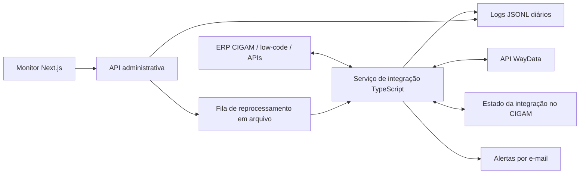
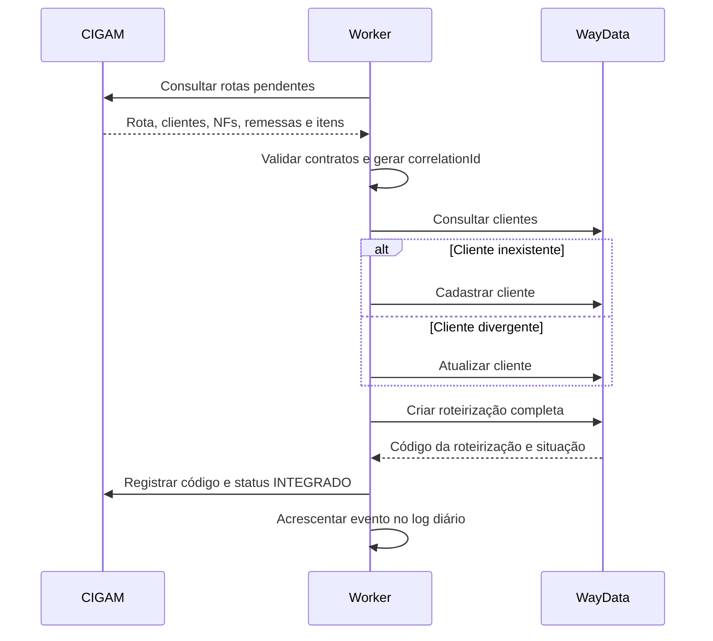
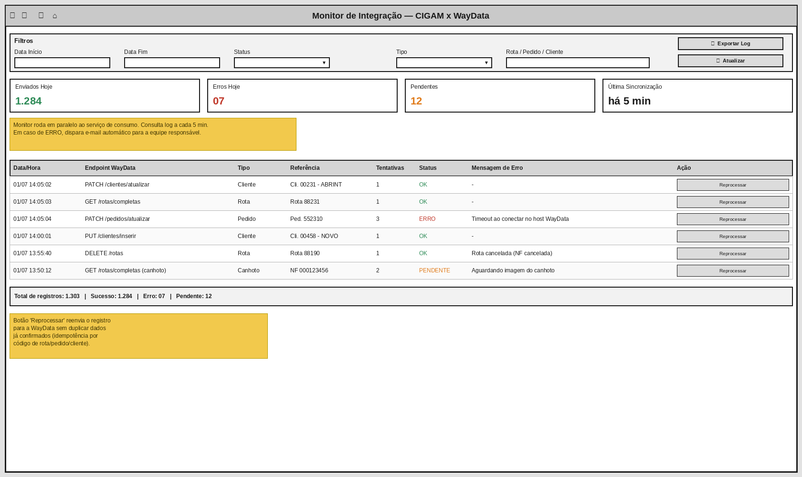

# Implementação da Integração CIGAM x WayData

## 0. Status e fonte de verdade

Este documento traduz em plano de construção o **MIC CIGAM x WayData — revisão 00, de 03/07/2026**. O MIC define o escopo funcional e os critérios de negócio; as collections Postman, o Swagger e os testes de homologação complementam os contratos técnicos. Em caso de divergência, a decisão deverá ser registrada e homologada com Panebras, CIGAM e WayData.

Em 08/08/2026, a credencial de homologação foi validada sem ser exposta nos documentos: as 15 consultas `GET` cadastradas no Kaivor responderam com 12 resultados `200`, três resultados `204` e nenhum `401`. Operações que alteram dados continuam condicionadas a massa controlada e autorização funcional.

### Implementação concluída em código

O repositório contém worker independente, clientes CIGAM/WayData configuráveis, validação de contratos, retentativas, concorrência limitada, idempotência, cancelamentos, retorno de entrega, download seguro e anexo de canhotos, fila durável de reprocessamento, logs sanitizados, health check, alertas SMTP opcionais e monitor com filtros, detalhes em drawer, exportação e reprocessamento. Typecheck, testes automatizados, build de produção e smoke local foram concluídos em 08/08/2026.

A conclusão de **homologação funcional e go-live** permanece bloqueada somente por dependências externas já previstas neste documento: contratos oficiais de escrita do CIGAM, massa controlada, autorização para operações mutáveis na WayData, SMTP e políticas de implantação/retenção. `SYNC_ENABLED` deve permanecer `false` até esses itens serem aprovados.

### Estado operacional local em 08/08/2026

O worker está configurado com a collection PANEBRAS real (`Cargas_Buscar`), autenticação raw preservada no `.env` ignorado e `SYNC_MODE=read_only`. Um ciclo real retornou 100 cargas, registradas uma única vez no monitor; a rotina não enviou, alterou ou cancelou qualquer dado. O monitor identifica explicitamente “Somente leitura”, pagina os eventos e bloqueia reprocessamento até a homologação dos contratos de escrita.

## 1. Objetivo

Implementar uma integração bidirecional entre o ERP CIGAM e a plataforma WayData para automatizar:

- sincronização de clientes;
- envio de remessas, pedidos, itens e roteirizações;
- atualização e cancelamento de registros já enviados;
- consulta de rotas e entregas;
- retorno dos estados de entrega;
- obtenção de comprovantes de entrega (canhotos);
- gravação de acompanhamentos e anexos nas notas fiscais do CIGAM;
- monitoramento operacional, reprocessamento e auditoria.

A solução será híbrida: parametrizações e recursos low-code no CIGAM, complementados por um serviço de integração e monitor em TypeScript. Não haverá banco de dados próprio da integração. Serão usadas as APIs oficiais do CIGAM e da WayData, e os eventos de auditoria serão armazenados em arquivos JSONL diários.

## 2. Princípios da solução

1. O CIGAM será a fonte oficial dos dados comerciais e do estado da integração.
2. A WayData será a fonte oficial da execução logística e dos estados das entregas.
3. Não haverá acesso direto às tabelas operacionais do CIGAM, desde que suas APIs atendam todas as operações necessárias.
4. Não haverá banco de dados exclusivo da integração.
5. Logs serão imutáveis, acrescentados em arquivos diários.
6. Credenciais, tokens e dados sensíveis não serão registrados nos logs.
7. Reenvios não poderão duplicar clientes, remessas, pedidos ou roteirizações.
8. O processamento periódico não dependerá de usuário conectado ao monitor.
9. Worker e monitor pertencerão ao mesmo repositório, mas serão executados como processos separados.
10. O cliente deverá ser validado na WayData antes do envio da rota.
11. Reprocessamentos automáticos ou manuais serão idempotentes e rastreáveis.

## 3. Escopo funcional

### 3.1 Saída do CIGAM para a WayData

- Consultar rotas liberadas para integração.
- Consultar os dados completos da rota.
- Obter clientes e endereços de entrega.
- Obter pedidos, notas fiscais, remessas e itens.
- Obter veículo e motorista.
- Identificar alterações posteriores ao primeiro envio.
- Identificar cancelamentos de NF, pedido, remessa ou rota.
- Validar ou cadastrar clientes na WayData.
- Criar ou atualizar remessas.
- Criar ou atualizar roteirizações externas.
- Inativar rotas e excluir pedidos/remessas quando aplicável.

### 3.2 Retorno da WayData para o CIGAM

- Consultar capas de rotas.
- Consultar rotas completas.
- Consultar status de rotas, pedidos e entregas.
- Identificar entrega, devolução, recusa ou não entrega.
- Obter o comprovante de entrega, quando disponível.
- Registrar acompanhamento na nota fiscal.
- Anexar o canhoto à NF correta.
- Registrar no CIGAM o código retornado pela WayData.
- Atualizar no CIGAM o estado da integração.

### 3.3 Monitoramento

- Exibir quantidades de sucessos, erros e pendências.
- Filtrar por período, status, entidade, operação e referência.
- Localizar registros por cliente, pedido, NF, remessa ou rota.
- Exibir tentativas, duração, código HTTP e mensagem de erro.
- Permitir reprocessamento manual.
- Exibir a data da última execução do worker.
- Disponibilizar os logs sanitizados para auditoria.
- Disparar alertas por e-mail conforme regras configuradas.

### 3.4 Entregáveis obrigatórios do MIC

- rotina automática com intervalo configurável em minutos;
- integração de clientes, rotas, pedidos, alterações e cancelamentos;
- retorno de status de entrega e canhoto assinado;
- anexo do comprovante em **Acompanhamentos da NF** no CIGAM;
- monitor independente da rotina, com indicadores em tempo real;
- log completo por chamada, alerta por e-mail e reprocessamento manual;
- homologação ponta a ponta, treinamento, entrada em produção e acompanhamento pós-go-live.

## 4. Fora do escopo

- Desenvolvimento de um novo roteirizador.
- Alteração do processo nativo de faturamento do CIGAM.
- BI ou indicadores analíticos avançados.
- Relatórios gerenciais personalizados.
- Acesso direto ao banco operacional do CIGAM, salvo mudança formal de arquitetura.
- Armazenamento do canhoto dentro dos arquivos de log.
- Manutenção de um banco de dados exclusivo para a integração.
- Alterações no roteamento, pedidos e faturamento nativos do CIGAM.
- Painel de BI/SLA e bloqueio de faturamento para cliente ainda não sincronizado, tratados pelo MIC como evoluções futuras.

## 5. Arquitetura



### 5.1 Worker

Processo Node.js permanente responsável por:

- agendamento dos ciclos;
- comunicação com as APIs;
- transformação dos modelos;
- validação dos payloads;
- controle de concorrência;
- retentativas;
- idempotência;
- gravação dos logs;
- consumo das solicitações de reprocessamento;
- alertas.

### 5.2 Monitor

Aplicação Next.js interna responsável por:

- dashboard operacional;
- leitura paginada dos arquivos diários;
- filtros e detalhamento;
- health check;
- solicitação de reprocessamento;
- exportação de logs sanitizados.

O Next.js não executará o processamento periódico principal.

### 5.3 Estado no CIGAM

Como não haverá banco próprio, as APIs CIGAM deverão permitir armazenar ou consultar:

- estado da integração;
- código da roteirização WayData;
- identificador idempotente;
- data da última tentativa;
- quantidade de tentativas;
- data da última sincronização;
- mensagem resumida do último erro.

Estados recomendados:

```text
PENDENTE -> PROCESSANDO -> INTEGRADO
                       -> ERRO
                       -> CANCELADO
```

Se o CIGAM não suportar esses controles, será necessária uma especificação adicional de persistência em arquivos. Os logs, isoladamente, não substituem o estado transacional da integração.

### 5.4 Divisão de responsabilidades

- **CIGAM/low-code:** seleção dos dados liberados, estado transacional, referências externas, acompanhamentos e anexos da NF.
- **Serviço TypeScript:** agendamento, orquestração, chamadas HTTP, validação, retentativas, idempotência, auditoria e alertas.
- **Monitor:** consulta operacional independente, filtros, indicadores, exportação e solicitação de reprocessamento.

## 6. Stack tecnológica

- Node.js LTS;
- TypeScript em modo estrito;
- Next.js para monitor e API administrativa;
- Zod para validação de entrada e saída;
- `fetch` nativo para HTTP;
- Pino ou logger compatível com JSON;
- JSONL para auditoria;
- Vitest para testes unitários e de integração;
- Playwright para testes do monitor;
- pnpm workspaces para o monorepo;
- ESLint e Prettier para qualidade de código.

## 7. Estrutura do repositório

```text
cigam-waydata/
├── apps/
│   ├── monitor/
│   │   ├── app/
│   │   │   ├── api/
│   │   │   │   ├── health/
│   │   │   │   ├── logs/
│   │   │   │   └── reprocess/
│   │   │   └── page.tsx
│   │   └── package.json
│   └── worker/
│       ├── src/
│       │   ├── main.ts
│       │   ├── scheduler.ts
│       │   └── worker.ts
│       └── package.json
├── packages/
│   ├── cigam-client/
│   ├── waydata-client/
│   ├── integration-core/
│   ├── file-logger/
│   ├── schemas/
│   ├── notifications/
│   └── shared/
├── data/
│   ├── logs/
│   ├── reprocess/
│   └── runtime/
├── tests/
├── docs/
├── package.json
├── pnpm-workspace.yaml
└── tsconfig.json
```

O diretório `data` deverá ficar em volume persistente e fora da área pública do servidor web.

## 8. APIs necessárias do CIGAM

Os nomes abaixo são conceituais. A implementação deverá usar os contratos oficiais disponibilizados pelo CIGAM.

### 8.0 Contratos já recebidos e validados

Na collection da PANEBRAS, os contratos ASMX abaixo estão mapeados no Kaivor. `Cargas_Buscar` e `Cargas_BuscarDetalhes` foram exercitados com HTTP `200`. `Cargas_MudaSituacao` e `Acompanhamento_Criar` estão ligados no cliente TypeScript, mas a execução real permanece desligada até a autorização funcional (`SYNC_MODE=read_only`).

```http
POST /API_ERP/api/API.asmx/Empresas
POST /API_ERP/api/API.asmx/Cargas_Buscar
POST /API_ERP/api/API.asmx/Cargas_BuscarDetalhes
POST /API_ERP/api/API.asmx/Cargas_MudaSituacao
POST /API_ERP/api/API.asmx/Acompanhamento_Criar
```

`Acompanhamento_Criar` concentra acompanhamento da NF e anexo do canhoto (`Anexos` em data URI). `Cargas_MudaSituacao` grava `A` aberto, `F` fechado e `C` cancelado. O código WayData é persistido em `data/runtime/route-map.json` porque esse contrato ASMX não devolve `CodigoRoteirizacao`. Credenciais da collection permanecem armazenadas de forma segura e não integram este documento.

### 8.1 Consultas

```http
GET /integracoes/waydata/rotas
GET /integracoes/waydata/rotas/{id}
GET /integracoes/waydata/alteracoes
GET /integracoes/waydata/cancelamentos
GET /clientes/{id}
GET /pedidos/{id}
GET /notas-fiscais/{id}
```

As consultas incrementais deverão aceitar, quando aplicável:

- empresa e unidade;
- data/hora da última alteração;
- status;
- paginação;
- limite por página;
- identificador da rota, pedido ou NF.

### 8.2 Gravações

```http
POST  /integracoes/waydata/retornos
PATCH /integracoes/waydata/rotas/{id}/status
POST  /notas-fiscais/{id}/acompanhamentos
POST  /notas-fiscais/{id}/anexos
```

As APIs de retorno deverão suportar:

- código interno CIGAM;
- código externo WayData;
- situação da integração;
- situação da entrega;
- data/hora do evento;
- mensagem de acompanhamento;
- metadados do comprovante;
- arquivo binário, Base64 ou URL segura, conforme contrato oficial;
- chave idempotente para impedir duplicidade de acompanhamento ou anexo.

## 9. API WayData

### 9.1 Ambientes documentados

```text
Homologação: https://wayds.net/integraway/api/v1
Produção:    https://restrito.waydatasolution.com.br/integraway/api/v1
Swagger:    https://wayds.net/integraway/docs/index.html
```

Os testes de 08/08/2026 validaram com `200` tanto a base sem porta explícita quanto a variante com `:8081`. A base canônica configurável será a documentada sem porta; a variante será mantida apenas como compatibilidade de homologação.

### 9.2 Autenticação

```http
Authorization: Bearer <token>
Content-Type: application/json
```

- Cada ambiente possui token próprio.
- A documentação informa que o token não expira.
- O token deverá existir somente em variável de ambiente ou cofre de segredos.
- A credencial de homologação foi validada em 08/08/2026 e está armazenada de forma cifrada no Kaivor.
- Tokens nunca serão copiados para documentação, logs, evidências ou código-fonte.

### 9.3 Clientes

Principais operações:

```http
GET    /cliente
GET    /cliente/id
PUT    /cliente
PATCH  /cliente
PATCH  /cliente/dados
DELETE /cliente
```

Antes de enviar uma remessa ou roteirização, todos os clientes envolvidos deverão estar cadastrados, incluindo partida, chegada e destinatários.

### 9.4 Remessas

Principais operações:

```http
GET    /remessa
PUT    /remessa/many
PATCH  /remessa/many
PATCH  /remessa/nfe
DELETE /remessa
```

Uma remessa representa um pedido que ainda não foi associado a uma roteirização. Após ser roteirizada, ela passa a ser tratada como pedido na WayData.

### 9.5 Roteirização externa

```http
PUT   /Roteirizacao/integracao
PATCH /Roteirizacao/integracao
```

O payload contém:

- nome da roteirização;
- cliente de partida;
- cliente de chegada;
- datas inicial e final;
- veículos;
- motorista;
- remessas;
- NF-e, CT-e e manifesto;
- emissor, vendedor e pagamento;
- itens, quantidades, pesos, volumes e valores;
- frete e datas operacionais;
- código da roteirização;
- flag de tracking.

Regras relevantes:

- clientes devem existir antes do envio;
- o nome deve ter no máximo 30 caracteres;
- data final deve ser posterior à inicial;
- códigos de itens devem ser únicos dentro da remessa;
- quantidade deve ser positiva;
- descrição do item deve ter entre 3 e 120 caracteres;
- o limite documentado para a integração externa é de 199 clientes por veículo;
- criação envia `codigoRoteirizacao = 0`;
- atualização envia o código retornado pela criação;
- na atualização, o payload completo deve ser reenviado;
- rotas, remessas ou itens omitidos numa atualização podem ser removidos da WayData.

### 9.6 Rotas, pedidos e retornos

```http
GET    /rota/capa
GET    /rota
GET    /rota/status
DELETE /rota
GET    /pedido/codigoEntrega
GET    /pedido/statusPedido
GET    /pedido/situacao
GET    /pedido/resumoStatusPedidos
PATCH  /pedido/many
DELETE /pedido
DELETE /pedido/many
```

Em 08/08/2026, as 15 consultas `GET` cadastradas foram revalidadas pelo MCP do Kaivor: 12 retornaram `200` e três retornaram `204` (código de entrega, status de rota e trajetória), sem falhas de autenticação. A consulta de cliente foi ajustada para um código real e o período de rotas para o limite aceito de quatro dias. `PUT`, `PATCH` e `DELETE` ainda exigem massa controlada e autorização funcional.

## 10. Fluxos de processamento

### 10.1 Envio de uma nova rota



### 10.2 Atualização

1. Consultar alterações incrementais no CIGAM.
2. Obter a estrutura completa e atual da roteirização.
3. Recuperar o código WayData previamente registrado.
4. Validar clientes e remessas.
5. Reenviar a estrutura completa por `PATCH`.
6. Atualizar o estado no CIGAM.
7. Registrar o resultado no log.

### 10.3 Cancelamento

1. Consultar cancelamentos pendentes no CIGAM.
2. Identificar o tipo: NF, remessa, pedido ou rota.
3. Executar a operação correspondente na WayData.
4. Tratar operação já inativa como resultado idempotente.
5. Registrar o resultado no CIGAM e no arquivo diário.

### 10.4 Status e canhoto

1. Consultar rotas ainda não encerradas.
2. Obter a rota completa e suas entregas.
3. Comparar o estado retornado com o último estado conhecido pelo CIGAM.
4. Registrar acompanhamento somente quando houver mudança relevante.
5. Detectar comprovante disponível.
6. Baixar e validar o arquivo.
7. Enviar o arquivo para a API de anexos do CIGAM.
8. Usar chave idempotente para impedir anexo duplicado.
9. Registrar a conclusão no log.

## 11. Agendamento e concorrência

- Intervalo configurável por variável de ambiente.
- Somente um ciclo geral poderá executar por vez em uma instância.
- Registros distintos poderão ser processados com concorrência limitada.
- O limite de concorrência será configurável.
- Timeout e cancelamento deverão existir em todas as chamadas externas.
- O worker deverá encerrar de forma graciosa, concluindo ou liberando operações em andamento.
- Em múltiplas instâncias, será necessário um mecanismo de coordenação fornecido pelo CIGAM ou pelo ambiente de execução.

## 12. Retentativas

Classificação recomendada:

| Situação | Ação |
|---|---|
| Timeout ou falha de rede | Retentar automaticamente |
| HTTP 429 | Respeitar `Retry-After` e retentar |
| HTTP 500/502/503/504 | Retentar com backoff |
| HTTP 400 | Não retentar automaticamente sem correção |
| HTTP 401/403 | Suspender ciclo e alertar credencial |
| HTTP 404 | Avaliar entidade e dependência antes de retentar |
| HTTP 409 | Conciliar como possível duplicidade |

O backoff deverá ser exponencial com jitter e quantidade máxima configurável.

## 13. Idempotência

Chaves sugeridas:

```text
CLIENTE:<empresa>:<codigoCliente>
REMESSA:<empresa>:<numeroRemessa>
ROTA:<empresa>:<codigoRotaCigam>
PEDIDO:<empresa>:<codigoPedido>
CANHOTO:<empresa>:<serie>:<nf>:<identificadorWayData>
```

O CIGAM deverá manter a relação entre suas referências e os códigos externos. Reprocessamentos devem reutilizar a mesma chave lógica.

## 14. Logs diários

### 14.1 Formato

```text
data/logs/integration-2026-07-18.jsonl
data/logs/integration-2026-07-19.jsonl
```

Cada linha será um documento JSON independente:

```json
{
  "id": "019f7b5d-82a4-7000-9000-123456789abc",
  "timestamp": "2026-07-18T14:35:22.321-03:00",
  "correlationId": "ROTA:01:85432",
  "direction": "CIGAM_TO_WAYDATA",
  "entity": "ROTA",
  "operation": "CREATE",
  "reference": {
    "empresa": "01",
    "unidade": "01",
    "rota": "85432",
    "pedido": null,
    "notaFiscal": null
  },
  "request": {
    "method": "PUT",
    "endpoint": "/api/v1/Roteirizacao/integracao"
  },
  "attempt": 1,
  "status": "SUCCESS",
  "httpStatus": 200,
  "durationMs": 842,
  "message": "Roteirização enviada",
  "wayDataCode": 940148
}
```

### 14.2 Requisitos do logger

- escrita sequencial por fila interna;
- append-only;
- rotação pela data local configurada;
- criação automática do diretório;
- tratamento de linha incompleta após interrupção;
- sanitização antes da gravação;
- retenção configurável;
- compactação opcional de arquivos antigos;
- proteção contra path traversal;
- limite de tamanho para mensagens e payloads;
- timestamps com timezone explícito.

### 14.3 Dados proibidos

- Bearer Token;
- usuário e senha;
- cookies;
- cabeçalho `Authorization`;
- canhotos em Base64;
- arquivos binários;
- payload completo sem sanitização;
- dados pessoais que não sejam necessários para auditoria.

## 15. Reprocessamento sem banco

Solicitações serão acrescentadas em:

```text
data/reprocess/queue-2026-07-18.jsonl
```

Modelo:

```json
{
  "id": "019f7b5d-82a4-7000-9000-123456789def",
  "requestedAt": "2026-07-18T15:00:00-03:00",
  "requestedBy": "usuario.cigam",
  "originalCorrelationId": "ROTA:01:85432",
  "entity": "ROTA",
  "reference": "85432",
  "status": "PENDING"
}
```

O histórico original não será alterado. O reprocessamento gerará novos eventos e apontará para o `correlationId` original.

Para garantir recuperação após reinício, o worker deverá reconciliar solicitações pendentes com o estado oficial mantido no CIGAM.

## 16. Monitor Next.js

### 16.1 Referência funcional do MIC

O MIC apresenta o wireframe abaixo como referência para o monitor de integração:



Esse wireframe deve ser utilizado como **referência funcional e de organização da informação**, não como um template visual obrigatório. A implementação possui liberdade para adotar uma interface mais moderna, responsiva e consistente com a identidade visual definida para o projeto, desde que preserve as capacidades previstas:

- filtros por período, status, tipo e referência;
- indicadores de enviados, erros, pendências e última sincronização;
- listagem dos eventos de integração;
- identificação de endpoint, entidade, referência e tentativas;
- exibição de status e mensagem de erro;
- reprocessamento manual;
- atualização e exportação dos logs;
- indicação de funcionamento e falhas do serviço.

O layout final deverá priorizar clareza operacional, leitura rápida de falhas e segurança nas ações de reprocessamento. Mudanças visuais não poderão remover informações ou ações previstas no MIC.

### 16.2 Tela principal

- período inicial e final;
- status;
- entidade;
- operação;
- rota, pedido, cliente ou NF;
- cards de sucesso, erro e pendência;
- horário da última sincronização;
- tabela paginada;
- detalhe do evento;
- reprocessamento;
- exportação.

### 16.3 Endpoints administrativos

```http
GET  /api/health
GET  /api/logs
GET  /api/logs/{id}
POST /api/reprocess
GET  /api/export
```

### 16.4 Segurança

- acesso restrito à rede interna ou VPN;
- autenticação obrigatória;
- autorização específica para reprocessar;
- proteção CSRF nas ações administrativas;
- rate limit;
- auditoria do usuário solicitante;
- arquivos de log nunca servidos diretamente pelo diretório público.

## 17. Configuração

Variáveis previstas:

```dotenv
NODE_ENV=production
TZ=America/Sao_Paulo

CIGAM_BASE_URL=
CIGAM_TOKEN=

WAYDATA_BASE_URL=
WAYDATA_TOKEN=

SYNC_INTERVAL_SECONDS=300
SYNC_CONCURRENCY=4
HTTP_TIMEOUT_MS=30000
MAX_RETRIES=5

DATA_DIRECTORY=
LOG_RETENTION_DAYS=180

SMTP_HOST=
SMTP_PORT=
SMTP_USER=
SMTP_PASSWORD=
ALERT_RECIPIENTS=
```

O arquivo real de variáveis não será versionado.

## 18. Tratamento de erros e alertas

Alertas deverão indicar:

- ambiente;
- entidade e referência;
- operação;
- horário;
- tentativa;
- endpoint sem credenciais;
- código HTTP;
- mensagem sanitizada;
- `correlationId` para consulta no monitor.

Para evitar excesso de mensagens:

- agrupar falhas repetidas;
- aplicar janela de silêncio configurável;
- alertar imediatamente falhas de autenticação;
- emitir resumo quando o serviço voltar ao normal.

## 19. Testes

### 19.1 Unitários

- validação dos schemas;
- transformação CIGAM -> WayData;
- transformação WayData -> CIGAM;
- idempotência;
- classificação de erros;
- cálculo de retentativas;
- sanitização;
- rotação do arquivo;
- leitura tolerante a linha incompleta.

### 19.2 Integração

- cliente inexistente, existente e divergente;
- remessa válida e parcialmente inválida;
- criação e atualização de roteirização;
- conflito `409`;
- cancelamentos;
- status de entrega;
- canhoto;
- indisponibilidade da WayData;
- indisponibilidade do CIGAM;
- token inválido;
- reprocessamento após reinício.

### 19.3 Ponta a ponta

| Cenário | Evidência esperada |
|---|---|
| Criar cliente | Cliente na WayData, status CIGAM e log de sucesso |
| Atualizar cliente | Dados atualizados sem duplicidade |
| Enviar rota | Estrutura completa disponível na WayData |
| Reenviar rota | Nenhuma duplicidade |
| Alterar rota | Estrutura final consistente |
| Cancelar pedido/NF | Registro correspondente inativo ou removido |
| Cancelar rota | Rota marcada como inativa |
| Atualizar entrega | Acompanhamento na NF correta |
| Receber canhoto | Arquivo válido anexado uma única vez |
| Simular falha | Log, retentativa e alerta |
| Reprocessar | Nova execução vinculada ao evento original |

## 20. Critérios de aceite

Uma funcionalidade será aceita quando possuir:

- registro controlado de homologação;
- resultado esperado documentado;
- resultado real no CIGAM;
- resultado real na WayData;
- evento correspondente no arquivo diário;
- ausência de credenciais nos logs;
- comprovação de idempotência;
- teste de erro e recuperação;
- aprovação do responsável funcional.

O projeto somente será considerado concluído após validação do fluxo completo:

```text
CIGAM -> Worker -> WayData -> Worker -> CIGAM
```

## 21. Implantação

Serão disponibilizados dois comandos:

```text
pnpm start:worker
pnpm start:monitor
```

No servidor:

- worker registrado como serviço permanente;
- monitor executado como aplicação web interna;
- diretório `data` em volume persistente;
- reinício automático em falha;
- health check;
- variáveis protegidas;
- backup dos logs;
- retenção definida;
- acesso de rede às APIs CIGAM e WayData.

Em Windows, a execução poderá ser registrada com WinSW, NSSM ou mecanismo oficial definido pela infraestrutura do cliente.

## 22. Fases de entrega

### Fase 1 — Fundação

- testar e validar a API WayData e suas collections Postman;
- modelar a tabela/estado de log e as configurações no CIGAM;
- estruturar o repositório, schemas, clientes HTTP e logger;
- implementar autenticação, temporizador, rotina automática e health checks.

### Fase 2 — Clientes e rotas

- validar, cadastrar e atualizar clientes;
- criar e sincronizar rotas, remessas e pedidos;
- armazenar código WayData no CIGAM;
- atualizar clientes, remessas e roteirizações;
- cancelar rotas e pedidos via `DELETE`;
- garantir idempotência e cancelamento em cascata.

### Fase 3 — Retornos e canhotos

- consultar estados de entrega nas rotas completas;
- baixar o canhoto assinado e anexá-lo em Acompanhamentos da NF;
- atualizar o estado correspondente no CIGAM;
- impedir anexos duplicados.

### Fase 4 — Monitor e alertas

- implementar o monitor independente com filtros, indicadores e logs;
- registrar endpoint, entidade, referência, tentativas, status e erro;
- implementar reprocessamento manual idempotente;
- configurar alertas por e-mail, exportação e health check.

### Fase 5 — Testes, homologação e go-live

- testes integrados;
- correções;
- homologação da Panebras;
- treinamento;
- implantação;
- acompanhamento pós-go-live.

## 23. Pendências antes do desenvolvimento

### WayData

- massa segura para testes de escrita;
- autorização funcional para `PUT`, `PATCH` e `DELETE` em homologação;
- contratos definitivos de criação/alteração de rotas e retorno de canhotos;
- esclarecimentos apenas onde ClickUp, Swagger e comportamento real divergirem.

### CIGAM/Panebras

- documentação das APIs CIGAM;
- URL e credenciais de homologação;
- endpoints de consulta e gravação;
- suporte a anexos e acompanhamentos de NF;
- suporte ao estado e ao identificador externo da integração;
- empresa e unidade de teste;
- clientes, pedidos, NFs e rotas controladas;
- regras de liberação, alteração e cancelamento;
- responsáveis pela homologação;
- ambiente de execução do worker e monitor;
- política de retenção dos logs e canhotos.

## 24. Riscos

| Risco | Mitigação |
|---|---|
| APIs CIGAM não cobrem anexos ou estado | Resolver contrato antes do desenvolvimento |
| Credencial WayData exposta, revogada ou trocada por ambiente | Cofre de segredos, rotação controlada e teste de autenticação no health check |
| Documentações divergentes | Validar contra homologação e Swagger |
| Atualização parcial remover dados | Sempre reenviar roteirização completa |
| Arquivos crescerem excessivamente | Rotação, paginação, retenção e compactação |
| Corrupção após interrupção | Escrita sequencial e tolerância a linha incompleta |
| Reprocessamento duplicar dados | Chave idempotente e estado oficial no CIGAM |
| Monitor e worker disputarem arquivos | Writer único e leitores somente leitura |
| Vazamento de token | Sanitização e segredos fora do repositório |

## 25. Fontes

- MIC CIGAM x WayData — revisão 00.
- Collection Postman WayData.
- Manual API IntegraWay — versão 2.0: <https://doc.clickup.com/90132427503/p/h/2ky4zcqf-11733/5dcc66a3125a9b8>
- Endpoint Roteirização/Integração: <https://doc.clickup.com/90132427503/p/h/2ky4zcqf-11813/cec7523e08bfe18>
- Swagger WayData: <https://wayds.net/integraway/docs/index.html>

## 26. Decisões registradas

- A solução combinará recursos low-code/parametrizações no CIGAM com serviço e monitor em TypeScript.
- O projeto será mantido em um único repositório.
- Worker e monitor serão processos separados.
- O monitor poderá ser desenvolvido em Next.js.
- Não haverá banco de dados próprio.
- Logs serão armazenados em arquivos JSONL diários.
- O estado oficial da integração deverá permanecer no CIGAM.
- A comunicação com o CIGAM deverá ocorrer preferencialmente por APIs oficiais.
- Não será adotada arquitetura de microsserviços para o escopo atual.
